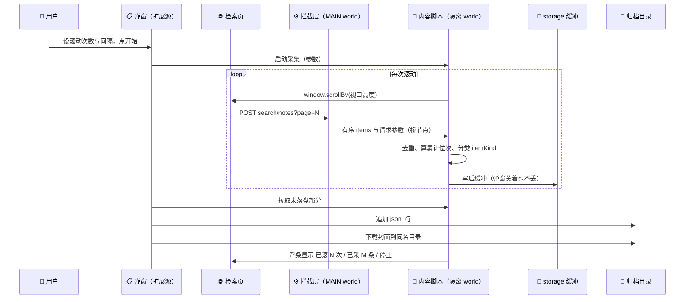

# XHS Archive 搜索结果页粗糙采集设计

_项目：xhs-archive（Manifest V3 扩展）／文档状态：Phase 0 取证完成，功能已实现（插件 `0.3.0`）／范围：检索结果页粗糙采集_

---

## 📋 目标与范围

在检索结果页按用户设定的节奏滚 N 次，把每次翻页拿到的**命中清单**落成一份 jsonl 加一份封面目录，服务于一个具体判断：**这批结果里哪些笔记值得做细致归档**。

它与既有的逐篇归档是两件事。细致归档产出"一篇笔记的完整快照"（正文、全部图片、评论、离线卡片页），分析单元是笔记；粗糙采集产出"某个检索词下我看到过哪些笔记、各在第几位"，分析单元是**检索批次**。后者是抽样框，前者是样本。

本期做：

- popup 驱动的一次有界滚动采集：滚动次数与间隔由用户设定
- 每次 `/api/sns/web/v2/search/notes` 响应的有序命中落成 jsonl（位次、关键词、筛选、发布时间、作者、四类计数、封面、完整图集 URL）
- 封面存进与 jsonl 同名的目录
- 管理页新增「目录浏览」：渲染卡片、勾选、导出工作清单

本期不做：

| 不做 | 理由 |
| --- | --- |
| 与逐篇归档打通 | 用户已决定两套数据独立。命中不回填 `metadata.json`，卡片页不标"已归档"，`_source.resultRank` 继续恒为 `null` |
| 自动滚到"采完为止" | 次数由人设定，插件不替人决定采多少 |
| 下载原图集、视频、评论 | 只下封面（一次检索几百张封面量级可控）。完整图集的 URL 记进 jsonl，要原图时留给细致归档 |
| 用 DOM 取数 | 实测页面是虚拟列表，只保留视口附近约 36 张卡片（见下） |
| 构造任何请求 | 与现有设计一致：只被动读取页面自己已经发出的响应 |

---

## 🔬 Phase 0 取证结论

用临时探针（`content/search-probe.js`，取证结束后删除）在登录态真实检索页取回，共三轮：2026-09-17 08:10、08:13、08:17 UTC。下表每一行都是实测，不是推断。

### 接口

| 事实 | 证据 | 对设计的含义 |
| --- | --- | --- |
| 检索结果接口是 `//so.xiaohongshu.com/api/sns/web/v2/search/notes`，POST JSON | 三轮均出现；host 是 `so.` 而非 `edith.` | 不能硬编码域名。现有 `network.js` 的 `isXiaohongshu` 判定按 `xiaohongshu.com/api/` 匹配，已经覆盖它 |
| 请求体：`keyword`、`page`、`page_size`(20)、`search_id`、`sort`、`note_type`、`ext_flags`、`geo`、`image_formats`、`message_id`、`session_id`；用户应用过筛选后**多出 `filters` 数组** | 08:13 的请求无 `filters`；08:17 的每一条都有 | `filters` 出现与否本身就是"这批结果被筛过"的信号 |
| `filters` 形如 `[{type:'sort_type', tags:['time_descending']}, {type:'filter_note_type', tags:['不限']}, …]` | 08:17 全部请求 | 筛选状态的原样快照，逐条入档 |
| `sort` 标量与 `filters` 会互相矛盾 | 08:17 全部请求里 `sort:"general"` 而 `filters.sort_type` 是 `["time_descending"]`，页面上「筛选」按钮同时处于 active（"已筛选"） | **两个都原样留存，不做归一**。文件名取 `filters` |
| 响应结构 `{code, success, msg, data:{has_more, items, request_dqa_instant}}` | 三轮 | `items` 是有序数组 |
| `items` 顺序 = 页面渲染顺序 | 第一项 id 与第一张卡片一致；两个 `hot_query` 块在数组与 DOM 网格里的位置一致（第 7、17 个网格子元素） | 位次可以直接用数组下标 |
| 每页 `items` 长度是 19、20 或 21 | 08:17 的第 14、18 页为 19 条，第 6 页 21 条（含 1 个 `hot_query`） | **不能假设每页 20 条**，一律用 `items.length` |
| `search_id` 标识一次检索会话 | 同一个关键词两次检索得到不同 id（`2gwnid9w86wb1p0yqou0p` / `2gwniqfdm16cf2s5tewxk` / `2gwnj5x570444u3qvx2d2@2gwnj7bo06573737ld44y`），同一会话内翻页不变 | 会话键，同时是去重键的一半 |
| 翻页由滚动触发，`page` 递增 | 08:17 一轮抓到 `page` 6→19，间隔 1.2–3 秒，`scrollY` 到 31862、文档高 35145 | 滚动只承担"触发请求"这一个职责 |

### 卡片字段

每个笔记条目形如 `{id, model_type:'note', note_card:{…}, xsec_token}`，`note_card` 字段：

| 字段 | 内容 | 备注 |
| --- | --- | --- |
| `display_title` | 标题 | 可能为空串（实测有） |
| `type` | `normal` / `video` | 视频笔记的标记 |
| `user` | `{user_id, nickname, nick_name, avatar, xsec_token}` | `nick_name` 与 `nickname` 同值，取 `nickname` 优先 |
| `interact_info` | `{liked_count, collected_count, comment_count, shared_count, liked, collected}` | 计数是字符串；**后两个是布尔** |
| `cover` | `{url_default, url_pre, width, height}` | `url_default` 与 `image_list[0]` 的 `WB_DFT` 同图 |
| `image_list` | 每项 `{height, width, info_list:[{url, image_scene}]}` | 实测最多 18 张，是**完整图集** |
| `corner_tag_info` | `[{type:'publish_time', text:…}]` | 每个卡片都有（实测 20/20） |

三条要写进契约的判断：

- **`liked` / `collected` 必须丢弃。** 它们是"当前登录账号有没有赞过、藏过"，是浏览者状态而不是笔记属性。留在数据集里既污染字段语义，也等于把"我看过什么"记下来。
- **发布时间有三种形态**：`06-23`（今年内月-日）、`2025-06-18`（跨年完整日期）、`4天前` / `6小时前`（近期相对时间）。三种都只到**日**（相对时间连日期都没有）。
- **时间改从笔记 id 解出，精确到秒。** 笔记 id 是 24 位十六进制（MongoDB ObjectID 形态），前 4 字节是生成时刻的 Unix 秒。所以 `4天前` 这类**根本不需要换算**——直接读 id 就有精确时间。卡片文字仍然保留（`publishTimeRaw`），并用来跟 id **交叉校验**。详见下文「发布时间怎么取」。
- **日期固定按东八区取**，不跟浏览器时区走：平台显示"06-23"用的是北京时间，换时区或挂代理不该让同一条记录的日期变一天。
- **相对时间的锚点是"响应到达时刻"**（`publishTimeObservedAt`），不是写盘时刻：一次采集可能跨午夜，用写盘时间做基准会把兜底路径的结果挪一天。
- **`image_list` 是完整图集，但不能当作"该笔记的图片总数"**。它是平台给检索的载荷，字段名要写成 `hitImageCount` 一类，避免与详情页语义的 `imageCount` 混淆。

### 计数与 DOM 的两个陷阱

| 事实 | 证据 | 含义 |
| --- | --- | --- |
| 计数为 0 时，DOM 给的不是 0 | 某篇 `liked_count:"0"`，DOM 卡片文本是 `likeText:"赞"` | DOM 路线会把真 0 变成"没抓到"。接口必须做主路 |
| 页面是虚拟列表，只保留视口附近约 36 张卡片 | `grid.childCount:37`、`translatedChildren:36`、`dataIndexChildren:36`、`grid.style.height:34857px`，而 `gridMaxDataIndex:372` | 滚过去的卡片会被卸载，DOM 无法事后汇总，只能"滚一次采一次" |
| DOM 的 `data-index` ≠ 累计下标，有约 +5～+6 的常量偏移 | page 17 第 11 条的累计下标 331 对应 `dataIndex` 337；page 18 第 1 条 341 vs 347；page 19 第 1 条 361 vs 366 | **位次只取接口累计下标**。偏移原因未定论（疑似页面上的 AI 回答块等非 `items` 元素占位） |

### 其余条目与筛选枚举

- 非笔记条目只观测到 `hot_query`：`{id:'<uuid>#<ts>', model_type:'hot_query', hot_query:{title:'大家都在搜', queries:[{id,name,search_word,cover}]}, xsec_token}`。三轮、约 380 条里**没有出现广告条目**，因此不为"广告"专门设计，只按 `model_type` 如实分类。
- 筛选枚举来自 `//edith.xiaohongshu.com/api/sns/web/v1/search/filter?keyword=…&search_id=…` 响应的 `data.filters`，实测全表：

| 分组（`type`） | 名称 | 取值 |
| --- | --- | --- |
| `sort_type` | 排序依据 | `general` 综合 · `time_descending` 最新 · `popularity_descending` 最多点赞 · `comment_descending` 最多评论 · `collect_descending` 最多收藏 |
| `filter_note_type` | 笔记类型 | 不限 · 视频笔记（视频） · 普通笔记（图文） |
| `filter_note_time` | 发布时间 | 不限 · 一天内 · 一周内 · 半年内 |
| `filter_note_range` | 搜索范围 | 不限 · 已看过 · 未看过 · 已关注 |
| `filter_pos_distance` | 位置距离 | 不限 · 同城 · 附近 |
| `filter_hot` | 热门词 | 一组 `origin_text`（= 检索词 + 后缀） |

  请求体里的 `note_type` 是数字（实测 `0` ↔ 不限），而枚举表的 id 是字符串。**两者的完整对应关系没有实测证据**，所以文件名用 raw 值，中文标签只作为附加信息写入文件头。

---

## 🎯 设计决策

| 决策 | 选择 | 理由 |
| --- | --- | --- |
| 采集点 | MAIN world 的响应拦截层，新建独立通道 | 每次响应本身就是一条完整、有序、带参数的记录；DOM 是 36 张的虚拟窗口，两次实测都证明它不可靠 |
| 位次 | 按**到达顺序累计**（第一个到达的条目为 1，依次递增），另给 `rankAmongNotes`；同时逐条记下 `page` 与 `indexInPage` | 设计时打算用 `(page - 1) * page_size + i`，实施时放弃：实测每页条数是 19–21 条不等，且用户可能从中间某页开始采（先在页面上滚过一段再点开始），按页码算会整体偏移。到达顺序在同一批内总是真实的，`page`/`indexInPage` 又留着，事后可以按页码重算 |
| 会话键 | `search_id` | 同一关键词的两次检索是两批观测，不该合并 |
| 筛选规则 | `filters` 原数组 + `sort`/`note_type` 原标量并列保留，文件名取 `filters` | 实测两者会矛盾，谁被服务端采纳未证实；不归一就不会丢信息 |
| 去重 | `search_id + noteId`，重复出现保留**首次**累计位次 | 平台分页去重不彻底；"第一次看到它在第几位"才是位次的定义 |
| 图集 | 记录完整 URL，只下载封面 | 封面撑得起勾选页；原图留给细致归档 |
| 计数 | 只取四个 `*_count`，丢弃 `liked`/`collected` | 后两者是浏览者状态 |
| 落盘方 | 采集在 content script，落盘在 popup（扩展源句柄） | 用户选定。弹窗失焦即销毁，所以采集循环与缓冲不能放在弹窗里 |
| 中断保护 | 采集缓冲写 `chrome.storage.local`；弹窗重开时继续落盘 | 关掉弹窗不该丢已采到的命中 |
| 上限 | 不设硬上限，次数与间隔完全由用户填 | 用户已决定。用实时计数 + 随时停止替代上限 |
| 勾选状态 | 另存 `.selection.json`，不写回 jsonl | 原始观测不可变，是既有原则 |

---

## 💾 数据契约

```
searches/
  新传论文发表_20260917-1617_general.jsonl
  新传论文发表_20260917-1617_general/
    001_6a39f801.jpg
    002_68515931.jpg
```

文件名三段：检索词（`sanitize()` 后截断）、采集开始时刻 `YYYYMMDD-HHmm`（本地时间）、筛选简写（`filters` 里的 `sort_type` 取值，无筛选则写 `general`）。同名已存在时加 `-2` 序号，不覆盖。

首行会话头：

```jsonc
{"_type": "session",
 "sessionId": "srch_20260917-1617_a1b2",
 "searchId": "2gwnj5x570444u3qvx2d2@2gwnj7bo06573737ld44y",  // 平台的一次检索会话
 "keyword": "新传论文发表",
 "filters": [{"type": "sort_type", "tags": ["time_descending"]}],  // 原样，未归一
 "filtersSource": "request_body",       // request_body | absent
 "filtersLabel": "排序依据 最新",         // 由枚举表映射，仅供人读
 "sort": "general", "noteType": 0,      // 原标量，与 filters 矛盾时两者都留
 "startedAt": "2026-09-17T08:17:00.000Z",
 "endedAt": "2026-09-17T08:19:30.000Z",
 "pages": {"first": 1, "last": 6},      // 本次采到的页码范围
 "scroll": {"requested": 6, "done": 6, "intervalMs": 2000, "stoppedBy": "rounds"},
 "coverage": {"hitCount": 118, "noteCount": 116, "hasMore": true, "complete": false},
 "cover": {"ok": 115, "fail": 3},
 "_pluginVersion": "0.3.0", "_schemaVersion": 4}
```

`complete` 用保守判据：只有"平台 `has_more` 为 `false` **且** 已采页数覆盖到最后一页"才为 `true`。滚 N 次就停的批次一律 `false`——它本来就不是全量。

其后每行一条命中：

```jsonc
{"_type": "hit",
 "seq": 7,                      // 本批次内的行序（1 起）
 "rank": 7,                     // 累计位次：含 hot_query 等非笔记条目
 "rankAmongNotes": 6,           // 只数 note
 "page": 1, "indexInPage": 7,   // 便于回溯是哪一页的第几条
 "seenAtRound": 1,              // 第几次滚动触发的这一页
 "itemKind": "note",            // note | hot_query | other
 "noteId": "6a39f801000000002100ac4c",
 "title": "今天当心软的审稿人",
 "author": {"userId": "5d3dc7fc000000001102f685", "nickname": "新传语料库",
            "avatar": "https://sns-avatar-qc.xhscdn.com/avatar/…"},
 "stats": {"likeCount": 17, "collectCount": 3, "commentCount": 2, "shareCount": 2},
 "statsRaw": {"likeCount": "17", "collectCount": "3", "commentCount": "2", "shareCount": "2"},
 "publishTimestamp": "2026-06-23T03:05:37.000Z",  // 从笔记 id 解出，精确到秒
 "publishDate": "2026-06-23",   // 主值：东八区的日
 "publishDateCard": "2026-06-23",  // 卡片文字给出的日，用于对账
 "publishDateSource": "note_id",   // note_id | card_full_date | card_month_day_year_inferred | relative_unresolved | missing
 "publishDateConflict": false,     // id 与卡片差超过一天 → true，两个日期都留
 "publishTimeRaw": "06-23",
 "publishTimeObservedAt": "2026-09-17T08:17:00.000Z",  // 锚点＝响应到达时刻，不是写盘时刻
 "noteType": "normal",          // normal | video
 "hitImageCount": 4,            // image_list 长度，不等于笔记总图数
 "coverUrl": "https://sns-webpic-qc.xhscdn.com/…!nc_n_webp_mw_1",
 "coverFile": "001_6a39f801.jpg",  // 文件名，实物在 searches/<批次名>/ 下；下载失败时为 null
 "images": ["https://…!nc_n_webp_mw_1", "…"],  // 完整图集，https 归一
 "url": "https://www.xiaohongshu.com/search_result/6a39f801000000002100ac4c?xsec_token=…",
 "xsecToken": "AB2wAYeRg1bIORbXKlA1jg7O0nemPshZBLHqM8vyg5SkU=",
 "capturedAt": "2026-09-17T08:17:02.000Z"}
```

`hot_query` 的命中行只保留 `rank`、`itemKind`、`title`（`hot_query.title`）与 `queries`（推荐词列表），`rankAmongNotes` 为 `null`。它也占一个位次，因此 `rank` 与 `rankAmongNotes` 必须分开——不分开的话"第 7 位"这句话没有定义。

图片 URL 统一转 https（接口给的是 http）。封面文件名用 `seq_noteId` 组成，`coverFile: null` 表示没下到，不假装有图。

---

## ⚙️ 采集流程

```mermaid
flowchart LR
    accTitle: Hit Lifecycle
    accDescr: A search response is parsed into hits, classified, deduplicated by note id, ranked, buffered, written to a batch file, then rendered and checked in the manage page for export.

    resp["⚙️ search/notes 响应"] --> parse["🔧 解析 items"]
    parse --> kind{"🔍 itemKind?"}
    kind -->|"note"| note["📝 命中行（完整字段）"]
    kind -->|"hot_query"| hq["📝 命中行（title + queries）"]
    kind -->|"other"| raw["📝 命中行（保留 raw）"]
    note --> dedup["🔁 按 noteId 去重，保留首次位次"]
    hq --> dedup
    raw --> dedup
    dedup --> buffer["💾 storage 缓冲"]
    buffer --> file["📤 searches/*.jsonl + 封面目录"]
    file --> browse["📋 管理页「目录浏览」"]
    browse --> check["✅ 勾选"]
    check --> sel["💾 *.selection.json"]
    check --> export["📊 导出工作清单"]

    classDef machine fill:#dbeafe,stroke:#2563eb,stroke-width:2px,color:#1e3a5f
    classDef human fill:#dcfce7,stroke:#16a34a,stroke-width:2px,color:#14532d
    classDef out fill:#f3f4f6,stroke:#6b7280,stroke-width:2px,color:#1f2937

    class resp,parse,kind,note,hq,raw,dedup,buffer machine
    class browse,check,sel human
    class file,export out
```





滚动用 `window.scrollBy`。实测滚动容器是 `window`：`scrollers` 列出的三个可滚元素全是左侧边栏，没有任何一个与结果相关。**不要写"找最外层可滚动元素"这类启发式**，它在这个页面上会命中侧栏。

不设硬上限的前提下，"有界"由三样东西替代：

1. **实时计数**：已滚 N 次 / 已采 M 条 / 用时 T，页面临时浮条与弹窗都显示
2. **一键停止**：浮条上有，弹窗上也有（浮条不是装饰——弹窗关了还能停）
3. **防空转提示**：连续若干轮没有新命中就提示"可能已经到底"，只提示不替用户决定

---

## 📋 管理页「目录浏览」

新增一个标签页，与既有的「笔记」「作者」并列。

- 列出 `searches/` 下的 `.jsonl`，文件名即批次摘要，另显示条数、时间、关键词、筛选标签
- 点开某批次 → 渲染卡片页：封面读同名目录里的本地文件，缺失时给明确占位而不是破图
- 每张卡片右上角勾选框；卡片上显示位次、点赞数、作者、标题（"有没有归档价值"就靠这些判断）
- 卡片上的原帖链接直接开笔记页，用户顺手点 📥 做细致归档。**不做自动跳转、不做批量跳转**
- 勾选状态写入同级 `*.selection.json`：`{sessionId, items:[{noteId, checkedAt}], updatedAt}`。不回写 jsonl
- 「导出勾选项」产出工作清单（jsonl + CSV 带 BOM，沿用既有导出规矩），内容含位次、关键词、筛选、封面相对路径——这样它能被单独引用

---

## ⚠️ 风险、边界与未证实项

| 项 | 现状 | 处置 |
| --- | --- | --- |
| `filters` 与 `sort` 谁被服务端采纳 | 未证实。往回翻的发布时间呈倒序，看起来认 `filters` | 两者都原样留存；文件名取 `filters`。不在文档里下结论 |
| `note_type` 数字与枚举表字符串的完整对应 | 只实测 `0` ↔ 不限 | 文件名用 raw 值，标签只作附加信息 |
| DOM `data-index` 的 +5～+6 偏移 | 原因未定论，怀疑是 AI 回答块等非 `items` 元素占位 | 不影响本设计（位次不取 DOM），记一笔备查 |
| 封面 URL 隔天是否还能下 | 未验证。前缀随请求刷新（同一张图在 16:16 与 16:17 两次响应里前缀不同），说明它是缓存键而非未来过期时间 | 封面**当场下载**，失败留 `coverFile: null`，不指望隔天补 |
| 广告条目的标记方式 | 三轮约 380 条未出现 | 按 `model_type` 如实分类即可，不做专门适配 |
| 无硬上限带来的频率风险 | 用户已决定不设上限 | UI 对低于 1000ms 的间隔给出提示（1500ms 以下不会更快拿到数据，懒加载本身要时间），并在 README 明示自行控制频率 |
| 弹窗被关闭 / 标签页被关闭 | 前者由 storage 缓冲兜住；后者会丢内存里未落盘的部分 | 浮条上显示"已落盘 / 未落盘"条数，让用户知道能不能关 |
| README 现有的公开承诺 | `README.md` 写着"不自动翻页、不自动滚动" | 实现时同步改写为"滚动次数与间隔由你设定，插件不设上限；请自行控制频率"。**承诺不能一边留着一边破** |

---

## ✅ 验收标准

1. 在检索页采一批（滚动 3 次、间隔 2 秒），`searches/` 下生成一个 jsonl 与同名目录，会话头含 `searchId`、`filters`、`sort`/`noteType`、页码范围、滚动参数
2. 该批次每条命中都有 `rank` 与 `rankAmongNotes`，且 `rank` 与本批次内条目的到达顺序一致；`hot_query` 行不计入 `rankAmongNotes`
3. 同一篇笔记在后续页重复出现时只保留首次位次，`seq` 不重复
4. 封面下载成功者 `coverFile` 指向真实文件，失败者 `coverFile: null` 且计数进会话头
5. 采集中途关掉弹窗，重新打开后未落盘的命中仍然写进同一个 jsonl（不产生第二个文件）
6. 管理页「目录浏览」能把该批次渲染成卡片页，勾选后导出工作清单，刷新后勾选状态仍在
7. `tests/selftest.js` 覆盖纯函数：文件名生成、去重与位次、`itemKind` 分类、命中行装配、`filters` 标签映射

---

## 📦 实施清单

| 文件 | 改动 |
| --- | --- |
| `manifest.json` | 版本 `0.3.0`；isolated 组加 `content/search.js`；不加新权限（`chrome.windows` 无需声明） |
| `content/network.js` | 新增 `search/notes` 响应通道，独立桥节点，**不进 `MAP`**；从 fetch/XHR 的请求 body 读 `page`/`filters`/`sort`/`note_type`/`search_id`；改为增量写桥（现有实现每次全量重写 JSON，几百条规模下会放大自触发回路） |
| `content/search.js` | 新建：滚动循环、命中缓冲、去重与位次、`itemKind` 分类、封面 URL 归一、进度上报、页面浮条（进度 + 停止） |
| `popup.html` / `popup.js` / `popup.css` | 采集区（次数、间隔、开始/停止、实时计数）、落盘（jsonl 追加 + 封面下载 + 欠账补写）、「在新窗口打开采集面板」 |
| `background.js` | `chrome.windows.create` 打开控制窗（避免弹窗失焦销毁） |
| `content/schema.js` | 会话/命中契约、文件名生成、`filters` 标签表、`SCHEMA_VERSION` 到 4 |
| `manage.html` / `manage.js` / `manage.css` | 「目录浏览」标签页、卡片渲染、勾选、`.selection.json`、导出 |
| `tests/selftest.js` | 上述纯函数的单测 |
| `README.md` | 承诺文案修改；新增功能说明与数据契约摘要 |
| `docs/DESIGN.md` | 「后续阶段」指向本文档；`_source.resultRank` 恒为 `null` 的说明补一句"粗糙采集刻意与其隔离" |
| `content/search-probe.js` 等 | **删除**：探针文件、`manifest.json` 中的 js 项、`main.js` 的面板按钮、`popup.html`/`popup.js` 的诊断按钮、`network.js` 末尾的 `__XHS_NETWORK_IS_API__` 导出。`isNonNoteItem()` 防御保留 |
---

## 📦 实施状态

已实现，插件版本 `0.3.0`。与上面设计的差异，以及实施中发现的问题：

| 差异 | 原因 |
| --- | --- |
| 位次改用"到达顺序累计" | 见「设计决策」表：每页条数不是固定 20，且采集可能从中间页开始，按页码算会整体偏移 |
| 检索结果的会话头字段比设计稿多一些 | 加了 `schemaVersion`、`sortOrderSource`（判据：`request_body` / `legacy_body` / `absent`）、`duplicates`（最多留 200 条重复登记）、`_note`（说明 rank 的口径）。删掉设计稿里多余的 `pages.pages` 嵌套，改成 `pages.all` |
| 没有做「独立控制窗」（`chrome.windows.create`） | 实施时判断不必要：采集在内容脚本里、缓冲在 `chrome.storage.local`，弹窗关掉只是暂停写盘，重新打开会自动接着写。少一个入口、少一份要维护的窗口生命周期 |
| `content/search-probe.js` 及其测试已删除 | Phase 0 取证结束。`network.js` 里的 `__XHS_NETWORK_IS_API__` 导出、`main.js` 的面板按钮、弹窗的诊断按钮一并移除；`isNonNoteItem()` 防御保留（有单测） |
| 加了一条"批次名不覆盖"的兜底 | 同名批次文件已存在时自动加 `-2`、`-3`；批次名一旦定下就存进 `chrome.storage.local`（`searchFile:<sessionId>`），中途改检索词也不会改名 |
| `run_at: document_idle` 下也能采到已在页面上的页 1 | 因为 MAIN world 的拦截层从 `document_start` 就在跑，批次留在桥上；内容脚本开始采集时先把桥上的批次收进来（只认 10 分钟内、且 `searchId` 一致的），所以"先搜好再点开始"不会丢掉第一页 |
| 重复条目单独登记，不回头改已定型的命中行 | 命中行可能已经写盘，"就地补一个字段"做不到也不会做。重复记进会话头的 `duplicates`（`noteId` / 本次 `rank` / 首次 `rank` / `page`），首次位次不动 |
| 封面在写行之前下载 | 这样行里的 `coverFile` 当场就是终值，不留"以后补"。代价是该批次的写盘要等封面下完；下载并发 6，失败留 `null` 并计入会话头 |
| 文件名里的排序方式改取 `filters`（实测反馈） | 第一版取请求体里的旧标量 `sort`，于是用户明明选了「最新」，文件名却是 `general`。现在优先取 `filters` 里 `sort_type` 的取值，取不到才回落到 `sort` |
| 检索词没拿到之前不建批次文件（实测反馈） | 会话头在"点开始"那一刻就写了，那时 `keyword` 还是空的，而文件名一旦定下就缓存不再改 → 用户看到的是 `未识别_20260917-1636_general.jsonl`。现在：采集仍在进行且还不知道检索词时，分片留在缓冲里等下一轮；采集已结束才用 `未识别` 兜底 |
| 卡片占位文案不再压住封面（实测反馈） | 占位文字用了绝对定位铺满封面区，而 `[hidden]` 被类选择器的 `display:flex` 盖过，于是**所有**卡片都显示"无封面"，哪怕图已经下好。现在：没有 `coverFile` 才渲染占位；有图时靠 `load` 事件隐藏占位、`error` 时反过来显示"图缺失"；CSS 补 `.batch-cover-ph[hidden]{display:none}` |
| 发布时间去掉了时分秒（实测反馈） | 第一版把 `06-23` 补成 `2026-06-23T04:00:00.000Z`，凭空多出时分秒。现在只在从卡片文字取日期时写 `publishDate`（日），并加 `publishDateSource` 说明这个日期是怎么来的 |
| 发布时间改为从笔记 id 解出（实测反馈 + 外部资料） | 卡片上的 `4天前` 无法还原成日期，第一版只能留空并标 `relative_pending`，用户看到"一半转了一半没转"。查证后确认笔记 id 前 4 字节就是生成时刻的 Unix 秒（MongoDB ObjectID 规范；独立实现见 OpenCLI PR #485，其单测含"UTC 跨日按东八区"一条），并在本项目真实数据上逐条吻合。现在 id 优先、精确到秒，卡片文字用于交叉校验，冲突打标并双留。原先设计的"区间 + 点估计 + ±1 天"方案随之取消 |

---

## 🕐 发布时间怎么取

### 一、主路径：从笔记 id 解出

笔记 id 是 24 位十六进制、MongoDB ObjectID 形态，**前 4 字节是生成时刻的 Unix 秒**。取前 8 位十六进制转成秒，加上东八区，就得到日期（要精确到秒也有）。

这不是本项目独创的偏方，有三条互相独立的依据：

| 依据 | 内容 |
| --- | --- |
| 格式规范 | MongoDB ObjectID 的前 4 字节即创建时刻的 Unix 时间戳（[官方文档](https://www.mongodb.com/docs/manual/reference/method/ObjectId/)） |
| 独立实现 | [OpenCLI PR #485](https://github.com/jackwener/OpenCLI/pull/485) 的 `noteIdToDate()` 用同样的读法，并带单测；其中一条专门验证"UTC 跨日按东八区算"（`0x69b739f0` = UTC 2026-03-15 23:00 → 北京 2026-03-16） |
| 本地实测 | 本项目在真实检索页取回的数据逐条对照：`06-09`→2026-06-09、`03-15`→2026-03-15、`07-09`→2026-07-09、`2025-12-18`、`2025-01-23` 全部与 id 解出的日期一致；`6天前` 那条解出 2026-09-10 19:41（北京），与观测时刻相差 6 天 21 小时，正对应平台显示的"6天前" |

### 二、它是非官方字段，所以必须对账

平台没有承诺"id 生成时刻"永远等于"发布时间"（OpenCLI 的注释也写明 `not an official API field`）。因此：

- **每条都做交叉校验**：id 解出的日 vs 卡片文字给出的日，差超过一天就置 `publishDateConflict: true`，**两个值都留在记录里**（`publishDate` 与 `publishDateCard`），管理页把冲突条数显示在批次行上。格式哪天变、平台改了生成规则，会立刻表现为"冲突 > 0"，不会悄悄写错一批数据。
- **合理性区间兜底**：解出的时间必须落在约 2001-09 ～ 2096-10 之间，否则视为解不出，回落到卡片文字（`publishDateSource` 记为 `card_full_date` / `card_month_day_year_inferred`）。
- **id 与卡片都拿不到日期时**（理论上只在 id 格式变化 + 卡片又是相对时间时才发生）：`publishDate` 为 `null`、来源记 `relative_unresolved`，但 `publishTimeRaw` 与 `publishTimeObservedAt` 仍在，事后可以补算，不必重新采集。

### 三、字段

| 字段 | 内容 |
| --- | --- |
| `publishTimestamp` | 从 id 解出的完整时刻（ISO，UTC）；id 解不出时为 `null` |
| `publishDate` | 主值，东八区的日（id 优先，回落卡片文字） |
| `publishDateCard` | 卡片文字给出的日，仅用于对账；相对时间或缺失时为 `null` |
| `publishDateSource` | `note_id` / `card_full_date` / `card_month_day_year_inferred` / `relative_unresolved` / `missing` |
| `publishDateConflict` | 布尔。id 与卡片差超过一天时为 `true` |
| `publishTimeRaw` | 卡片原文（`06-23` / `2025-06-18` / `4天前`） |
| `publishTimeObservedAt` | 观测锚点（响应到达时刻） |

> 📌 曾设计过一套"相对时间按锚点减、给出区间 + 点估计 + ±1 天"的方案（因为当时以为只能拿到卡片文字）。实测确认 id 可解之后放弃：直接读 id 更准、代码更少，而且没有"区间"这种需要下游特殊处理的形状。**已被证伪的不是这套推理，而是它的前提**——如果哪天 id 解法失效，那套区间逻辑仍是对的方向（届时卡片文字与观测锚点都还在数据里，可以补算）。

---

## 🔗 参考

本文档的技术结论全部来自本项目在登录态真实检索页的实测（Phase 0 探针，2026-09-17 三轮），没有引用第三方实现。平台接口与页面结构随时可能改动，实施前若与实测不符，以真实流量为准。

既有设计（`metadata.json` / `annotation.json` / `authors.json` / `comments.json` 契约、采集可信度与人工标注改造）见 `docs/DESIGN.md`。
