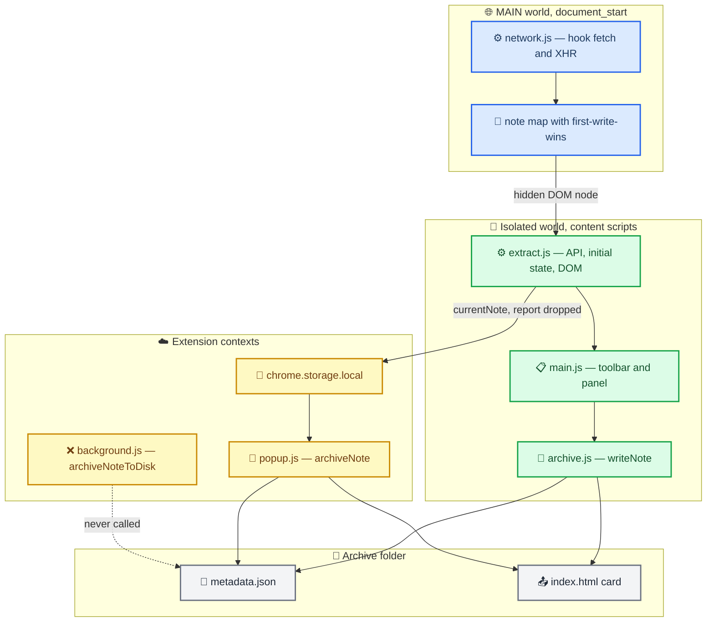
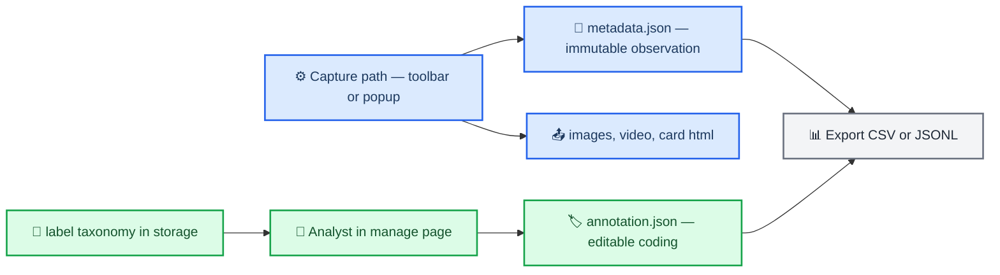
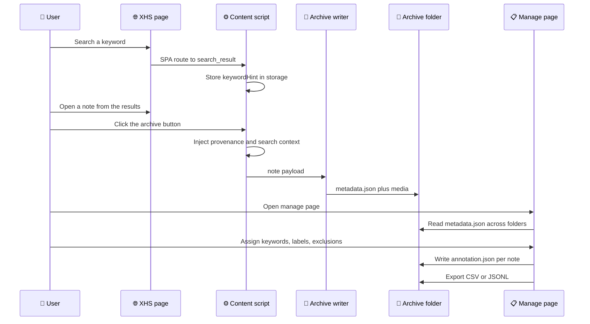

# XHS Archive 采集可信度与人工标注改造设计

_项目：xhs-archive（Manifest V3 扩展，当前 `0.1.0`）／文档状态：设计已定稿，P0 代码未开始／范围：P0_

---

## 📋 目标与范围

当前插件能把一篇笔记的图片、视频、正文与统计数存到本地，但对"**这批样本能不能被描述、能不能被引用**"这件事几乎没有支撑：归档时不知道数据是从哪条路径抽取的、哪些字段是缺失的、笔记是从哪个检索词下看到的。本次改造只解决这一件事。

目标（P0）：

- 每条归档记录自带**溯源自描述**：抽取策略、是否 stale、字段来源、缺失字段清单
- 每篇笔记可被**人工编码**：关键词、排序方式、标签、排除标记、备注，且标注与机器观测物理分离
- 关键词具备**零成本自动捕获**：从检索页 URL 与 SPA 路由拿到，抓不到就留空交由人工补录
- 支撑**批量贴标签**：固定词表 + 多选 + 批量操作 + 可导出为分析用的 CSV/JSONL

不在本期范围：

- resultRank（笔记在检索结果中的位次）与检索接口拦截
- 评论区采集与 `comments.json`
- 作者粉丝数/笔记数/简介/认证的主动补全
- 三处写盘逻辑的结构性重构

> 📌 **关键约束：结果位次不可事后补录。** 关键词、排序方式、标签都可以在归档后由人在管理页补，但"这篇笔记当时在结果页第几位"只存在于检索响应到达的那一刻。本期明确放弃它，因此 P0 完全不触碰 MAIN world 的网络拦截，风险与工作量都大幅下降。

## 🎯 设计决策

| 决策 | 选择 | 理由 |
| --- | --- | --- |
| 检索追踪 | 放弃 resultRank，只做 URL 关键词捕获 + 人工补录排序方式 | 位次需要拦截响应并维护有序列表；放弃后免去 MAIN + ISOLATED 双文件桥接，且人工补录已覆盖描述性分析所需 |
| 标注存储 | 每篇笔记目录下的 `annotation.json` | 关键词是"笔记 × 检索"的属性而非笔记属性，需要数组；目录迁移时标注不孤儿化 |
| 写盘结构 | 不重构，三处分别改 | 尊重既有决策；用"字段单点注入"与"键自检"替代重构所能带来的防漂移收益 |
| 标注写入边界 | 管理页永不写 `metadata.json` | 观测记录保持不可变，标注路径与归档路径物理隔离、零冲突 |

### 决策一：放弃 resultRank 与检索接口拦截

原方案第 1 项（`content/search_capture.js`）被拆成三段，成本递进，本期只取第一段：

| 想要的数据 | 实现方式 | 本期取舍 |
| --- | --- | --- |
| `keyword` | 主路径：MAIN world 从**检索接口的 URL**里读 `keyword`（`/api/**/search/*`，含 `search/filter`、`search/recommend`、`search/onebox`）→ `#xhs-search` 桥节点 → `keywordHint`；辅路径：`content/main.js` 包装 `history.pushState/replaceState` 时看地址栏 | 采用（接口优先，地址栏兜底） |
| 「是不是从搜索进来」 | 按可信度排序：① `xsec_source` ② 路径 `/search_result*` 或地址栏带 `keyword` ③ `source`。判据写进 `_source.typeSource` | 采用（`source` 只是版式水印，不能单独作数） |
| `sortOrder` | URL 中通常不存在，必须读检索请求 body | 不采用，改为管理页人工补录 |
| `resultRank` | 必须拦截响应、维护有序列表、处理分页与换词重置 | 不采用，字段保留为 `null` |

`sortOrder` 之所以不在 URL 中，是因为它与 `keyword`、`page`、`note_type` 等一同作为请求体参数提交，取值来自一组固定枚举[^1]。检索结果的有序列表位于响应的 `items` 数组中，其中还混有 `hot_query`、`rec_query` 这类非笔记条目，需要显式排除后才能得到名次[^2]——这正是位次必须当场捕获的原因。

`_search.resultRank` 与 `_search.sortOrder` 仍然**保留在 schema 中并写入 `null`**，同时登记进 `_fieldsMissing`。这样将来升级到 P1 补齐拦截时，不需要改动 schema，也不需要对既有归档做数据迁移。

### 决策二：人工标注写入每篇笔记目录下的 annotation.json

`metadata.json` 是机器观测记录，人工编辑只写同级的 `annotation.json`。管理页的目录遍历（`manage.js` 的 `walkDir`）已经用"目录下是否存在 `metadata.json`"来识别笔记目录，这个条件正好可以复用作**写入路径白名单**——只允许写 `<含 metadata.json 的目录>/annotation.json`，把写权限的爆炸半径压到最小。

需要配套的变化：管理页目前以 `mode: 'read'` 打开归档根目录（`manage.js` 第 33、158 行），必须切换到 `readwrite`。只读句柄上提权可能被拒绝，因此必须实现降级路径：先 `requestPermission({ mode: 'readwrite' })`，失败则提示用户重新选择归档目录。

### 决策三：不重构三处写盘结构，改为单点注入

现状是三份重复实现，且已经出现行为分歧。不做合并的前提下，用两条规矩把风险压住：

1. **字段单点注入**：所有新增的溯源自描述字段一律在 `extract()` 定型处注入一次；写盘函数通过 `{ ...note }` 自动继承，**不需要知道这些字段的存在**。三处写盘只需处理"结构性差异"（版本号、根目录标识）。
2. **键自检**：在 `popup.js` 归档成功后，把实际生成的 metadata 键集合与 `content/schema.js` 中声明的必需键清单比对，缺失项直接显示在弹窗状态栏。三处一旦漂移，马上可见。

同时清理 `background.js` 中的死分支（见「现状与结构性发现」），把需要维护的写盘实现从三处降到两处。

### 已否决方案

<details>
<summary><strong>💬 被评估后否决的替代方案</strong></summary>

| 方案 | 否决原因 |
| --- | --- |
| 抽取 `archive_core.js` 统一三处写盘 | 决策上选择不动结构；用单点注入 + 键自检替代 |
| 主动请求 `otherinfo` 补齐作者粉丝数 | 接口要求 `X-S`/`X-T`/`x-S-Common` 签名头，签名与 URI、body、cookie 绑定[^3]；自行实现签名器属于重写平台客户端，脆弱且超出插件定位 |
| 自动翻滚检索结果页以补全样本 | 会制造平台侧异常流量；且自动翻页改变了账号看到的排序分布，反而污染样本 |
| 评论数据存入 `chrome.storage.local` | 默认配额 10MB，评论体量会迅速击穿；评论只应走 DOM 桥与落盘 |
| 把关键词当作笔记的属性（单值字段） | 同一篇笔记可能同时出现在多个检索词下，单值会产生覆盖与歧义 |

</details>

---

## 🔍 现状与结构性发现

以下结论均来自对现有源码的逐行阅读，行号对应当前 `0.1.0` 版本。

### 写盘路径与死分支

清单原第 6 项指定修改 `background.js` 的 `archiveNoteToDisk()`，但该函数**当前没有任何调用方**：全仓库不存在发送 `msg.type === 'archiveNote'` 的代码。实际生效的写盘路径是另外两条。



| 触发方式 | 实际执行者 | 句柄来源 |
| --- | --- | --- |
| 页面右下角按钮（主路径） | `content/archive.js` 的 `writeNote()`（第 88–146 行） | 页面源 IndexedDB |
| 弹窗「归档当前笔记」 | `popup.js` 的 `archiveNote()`（第 109–170 行） | 扩展源 IndexedDB |
| `background.js` 的 `archiveNoteToDisk()`（第 90–152 行） | 无调用方 | 扩展源 IndexedDB |

> 📌 上表是 `0.1.0` 的原状。P0 已删除这条死分支及其专用辅助函数，`background.js` 从 217 行降到 50 行，写盘实现由三份变为两份——详见「实施状态」。

### 双句柄域导致"归档根目录"实际上是两个

内容脚本与页面共享源，因此 `content/archive.js` 存在 `xiaohongshu.com` 源下的 IndexedDB；`popup.js` 与 `background.js` 存在扩展源下。`FileSystemHandle` 既不能跨源，也不能经 `chrome.storage` 或 `sendMessage` 传递（扩展消息通道是 JSON 序列化的），所以两处句柄永久独立。

实践含义：如果用户没有在两个入口各选一次同一个目录，"页面归档"和"弹窗归档"会写进两个不同的物理目录。新增的标注文件因此需要记录归档根目录标识（`_archiveRoot`），以便事后判断某条记录来自哪一个根。

### 溯源信息在归档时被丢弃，且 stale 兜底可能写错笔记

`content/main.js` 第 182 行把 `{ data, report, ts }` 存进 `chrome.storage.local`，但 `popup.js` 只取 `.data`；两条写盘路径收到的都只是 `note` 对象。结果是 `report.strategyUsed`、`report.isStale`、`report.warnings`、`stateSourcePath` **全部没有进入 `metadata.json`**——事后无法判断某条记录是权威 API 抽取还是 DOM 兜底。

更严重的是 `content/extract.js` 第 524–531 行的兜底逻辑：当 URL 中的 noteId 匹配不到缓存时，会退化为"使用最近抓到的任意一条"，把 `isStale` 置为 `true`，**但归档照旧执行**。在检索页或推荐流中缓存了多张卡片的情况下，这可能把 A 笔记的元数据写进 B 笔记的目录，而这类错标在数据集里几乎无法事后发现。

### DOM 桥与 MutationObserver 的自触发回路

`content/network.js` 第 56–77 行每次数据变化都把整个笔记缓存序列化后重写进隐藏 DOM 节点；`content/main.js` 第 203–204 行的 MutationObserver 监听 `document.documentElement` 的 `subtree` 与 `childList`——**改写自己那个节点的 `textContent` 同样会触发它**，形成 `flushToDom → observer → runExtract → JSON.parse(整个缓存)` 的循环。目前被 300ms 去抖与 2.5s 定时器掩盖着。本期不接评论，体量不会放大，因此该问题列入 P2。

### 既有缺陷清单

| 缺陷 | 位置 | 症状 |
| --- | --- | --- |
| 首次写入优先 | `network.js` 第 89 行 `if (id && !MAP[id])` | 从列表流先抓到的薄卡片永久占位，详情页的完整卡片被丢弃 |
| `responseText` 在 `responseType='json'` 时抛异常 | `network.js` 第 140 行 | 该类响应被静默漏抓 |
| `_videoFile` 判断错误 | `popup.js` 第 123 行 | "仅封面"模式下仍写非 null，离线卡片出现过期 `<video>` |
| 缺 `_videoQuality` | `popup.js` 第 118–124 行 | 弹窗归档的记录无法得知当时选的画质 |
| `url` 字段可能被写成对象 | `extract.js` 第 240 行 `note.url \|\| note.urlInfo` | `urlInfo` 是对象，污染元数据 |
| 统计数失败与真实 0 不可分 | `extract.js` 第 373–403 行 | 解析失败返回 `0`，而"0 赞"在研究中是很强的断言 |
| 标签混入非话题条目 | `extract.js` 第 181–183 行 | 未按 `type === 'topic'` 过滤 |
| 标签吞掉尾部标点 | `extract.js` 第 366–370 行 | `#露营，` 解析为 `露营，` |
| 缓存无上限淘汰 | `network.js` 的 `MAP` 与 `URLS` | 长会话下内存与序列化开销持续增长 |
| 死分支 | `background.js` 第 198–203 行 | 无人调用的 `archiveNote` 处理器 |

## 💾 数据契约

### metadata.json 增量

全部由 `content/extract.js` 的 `extract()` 在定型处注入（约第 550 行之后），因此两条生效的写盘路径会自动继承，无需各自维护。

```jsonc
{
  "_schemaVersion": 2,
  "_pluginVersion": "0.2.0",
  "_captureId": "cap_...",

  "_extraction": {
    "strategy": "API",                  // API | INITIAL_STATE | DOM
    "stateSourcePath": "note API cache",
    "isStale": false,
    "noteIdMismatch": false,            // 选中的笔记 id 与 URL 不一致 —— 归档闸门的判据（isStale 已于实现中删除，见「实施状态」）
    "urlNoteId": "...", "pickedNoteId": "...",
    "warnings": [],
    "pageUrl": "...", "container": "id=noteContainer",
    "extractedAt": "2026-02-19T10:00:00.000Z"
  },

  "_author": {
    "userId": "...", "nickname": "...", "avatar": "...",
    "profileUrl": "https://www.xiaohongshu.com/user/profile/...",
    "fansCount": null, "noteCount": null, "bio": null, "verified": null,
    // 下面几项只有在看过该作者主页、被 authorCache 命中时才有值
    "followsCount": null, "interactionCount": null, "redId": null,
    "verifyText": null, "ipLocation": null,
    "source": "note_card",               // note_card | dom（+profile_cache 表示已用主页缓存补齐）
    "profileCapturedAt": "2026-02-19T09:00:00.000Z",  // 有缓存命中时才有
    "profileSource": "profile_api"
  },

  "_publishTimeSource": "api_timestamp",  // api_timestamp | dom_absolute | dom_relative | missing
  "_publishTimeRaw": "6天前",
  "_publishTimeObservedAt": "2026-02-19T10:00:00.000Z",

  "_tagSource": "api_taglist",            // api_taglist | dom_hashtag
  "_tagsRaw": [ { "name": "露营", "type": "topic" } ],

  "_statsSource": "api",                  // api | state | dom | missing
  "_statsRaw": { "likeCount": "1.2万", "collectCount": "88", "commentCount": "0", "shareCount": null },

  // 样本来源（抽样框架）：这篇笔记是从哪个入口拿到的。
  // 平台在 URL 里就给了线索，认不出的原样留在 raw 里，不猜。
  "_source": {
    "type": "search",                     // search | profile | related | feed | direct | other | unknown
    "label": "搜索",                       // 人读
    "raw": "pc_search",                   // 平台参数原文，可追溯（一律保留，即使不是判定依据）
    "typeSource": "xsec_source",          // 判据：xsec_source | source | url_keyword | url_path | none
    "keyword": "露营",                     // ⚠ 仅 type==='search' 时才有值
    "keywordSource": "url_auto",          // url_auto | none
    "keywordFromHintAt": null,            // 来自"最近一次检索"时的提示时间戳
    "sortOrder": null,
    "sortOrderSource": "none",            // manual | none
    "resultRank": null,
    "capturedAt": "2026-02-19T10:00:00.000Z"
  },

  "_collection": { "collectorId": "", "accountLabel": "", "accountSource": "none" },
  "_archiveRoot": { "context": "page", "name": "xhs-archive" },

  "_imageOk": 4, "_imageFail": 0,        // 归档结束时补写：媒体实际下载成败
  "_videoOk": false, "_videoCoverOnly": false, "_videoError": null,

  // 评论摘要（正文在 comments.json，metadata 保持轻量——管理页要遍历所有 metadata.json）
  "_commentsMeta": {
    "capturedCount": 12, "topLevel": 10, "replies": 2,
    "declaredTotal": 11, "hasMore": true, "complete": false,
    "sources": ["state", "api"], "capturedAt": "2026-02-19T10:00:00.000Z"
  },

  "_fieldsMissing": ["source.resultRank", "source.sortOrder",
                     "author.fansCount", "author.noteCount",
                     "author.bio", "author.verified"]
}
```

关于 `_author`：笔记详情响应中嵌套的 `user` 对象只包含 `user_id`、`nickname`、`avatar` 等少数字段[^4]，把它建模为"仅这几项"的类型定义同样见于第三方实现[^5]。粉丝数、笔记数、简介、认证**不在**笔记详情载荷中，只在 `/user/profile/<id>` 页面的 `__INITIAL_STATE__.user.userPageData` 或 `user/otherinfo` 接口里[^6]。由于该接口需要签名头[^3]，本期只能用 `null` 加 `_fieldsMissing` 如实标注，机会性补全列入 P1。

`_statsSource` 是必须的：现有 `extractStatsFromDom()` 在解析失败时返回 `0`，与真实的"0 赞"无法区分，会直接影响下游统计。

`_publishTimeObservedAt` 同样是必须的：DOM 回退路径只能拿到相对时间（如"6天前"），没有观测时刻就永远无法还原为绝对时间。

### annotation.json
与 `metadata.json` 同级，由管理页写入，是唯一的可写人工字段集合。

```jsonc
{
  "noteId": "...",
  "captureIds": ["cap_..."],
  "keywords": ["露营", "露营装备"],        // 数组：一篇可出现在多个检索词下
  "sortOrders": ["popularity_descending"], // 人工补录
  "labels": ["重点样本"],
  "exclude": false,
  "excludeReason": "",
  "note": "",
  "annotatorId": "",
  "createdAt": "2026-02-19T10:00:00.000Z",
  "updatedAt": "2026-02-19T10:05:00.000Z"
}
```

写入规则：

- 管理页**永不写 `metadata.json`**
- 路径白名单：只允许写"含 `metadata.json` 的目录 / `annotation.json`"
- 归档路径只写 `metadata.json`、`index.html`、`images/`、`video/`，不触碰 `annotation.json`

> 📌 **当前 UI 只暴露 `labels` / `note` / `annotatorId`**（抽屉改版后的决定：关键词与排序属于采集批次，不该塞在单篇里）。`keywords` / `sortOrders` / `exclude` **仍留在 schema 与导出列里**——老数据保留、`exclude` 与 `sortOrders` 可由顶部批量栏设置，`keywords` 目前无编辑入口（自动捕获仍在，见 `_search.keyword`）。字段留在白名单里也是刻意的：`persistAnnotation()` 会剔除非白名单键，删掉它会导致既有 `annotation.json` 里的人工关键词在下次保存时被清掉。

导出时关键词列取"人工值优先"：`annotation.keywords` 非空则使用它，否则回落到 `_search.keyword`，并在独立列标注 `keywordSource`（`manual` / `auto` / `auto_edited`），两者都保留在导出文件中。

### authors.json

归档根目录下的单文件作者表，由页面面板的「保存作者」按钮写入（数据来自 `authorCache`，不做任何自动跳转）。

```jsonc
{
  "schemaVersion": 2,
  "updatedAt": "2026-02-19T10:05:00.000Z",
  "authors": {
    "56e021eaa9b2ed46ef7c84cc": {
      "userId": "56e021eaa9b2ed46ef7c84cc",
      "nickname": "研究选题传送门",
      "profileUrl": "https://www.xiaohongshu.com/user/profile/56e021eaa9b2ed46ef7c84cc",
      "redId": null,
      "fansCount": 12000, "followsCount": 312, "noteCount": 37, "interactionCount": 99000,
      "bio": "...", "verified": true, "verifyText": "学术博主", "ipLocation": "上海",
      "source": "profile_api",
      "capturedAt": "2026-02-19T09:00:00.000Z",   // 当前这组值第一次被看到
      "checkedAt": "2026-02-19T10:05:00.000Z",    // 最近一次确认它还是这组值
      "history": []                                // 通常为空；值变过才存旧快照（上限 50 条）
    }
  }
}
```

两条合并规矩（`schema.mergeAuthors()`，有单测覆盖）：

- 程序**只覆盖自己认识的键** —— 你手工加的字段（领域、备注…）在重写时一律保留
- 传入的 `null`/`undefined` **不覆盖已有的非 null 值** —— 一份残缺载荷不该抹掉已知数据

`history` 只在数值真的变化时写入旧快照；同一组值反复保存只刷新 `checkedAt`，所以文件不会因为"多点了几次"而膨胀。字段清单集中在 `schema.AUTHOR_FIELDS`，`extract.js` 产出、`archive.js` 合并、导出出列三处共用一份。

**这个文件里不会出现登录者本人。** 身份接口（`user/me`、`user/selfinfo`）返回的是当前登录账号，页面加载时就会请求；它只被用来记录 `selfUserId`，用于把本人从采集链路里剔除：捕获时不进 `authorCache`、交给按钮前再过滤一次、写盘时还会把历史上误收的本人记录删掉（按钮会提示"并清掉了误收的本人记录"）。副作用是：归档自己的笔记时 `_author.fansCount` 等仍为 `null`——那被刻意排除在外。

> ⚠️ **已知上限：** 单文件是读-改-写，两个标签同时点「保存作者」有极小概率丢记录（单用户手工点按，窗口是毫秒级）。真要并发，改成"每作者一个文件"即可，`mergeAuthors()` 的输入输出形状不用变。

### comments.json

评论正文单独成文件（与 `metadata.json` 同级），由归档路径写入。

```jsonc
{
  "noteId": "6a983cd9000000001001d1fc",
  "archivedAt": "2026-02-19T10:05:00.000Z",   // 写入时刻（评论的采集时刻在 meta.capturedAt）
  "meta": { "capturedCount": 12, "topLevel": 10, "replies": 2, "declaredTotal": 11,
            "hasMore": true, "complete": false, "sources": ["state", "api"] },
  "comments": [
    { "id": "6a98425c...", "parentId": "", "content": "…", "userId": "...", "nickname": "…",
      "likeCount": "1", "createTime": 1788363356000, "ipLocation": "四川",
      "isAuthor": false }
  ]
}
```

设计取舍：

- **扁平 + `parentId`**，不做嵌套。子评论本来就是随父评论一起给的（`subComments`），压平后 `parentId` 指向父评论 id；分析时按 `parentId` 分组即可，导出 CSV 也直接。子评论页（`root_comment_id`）同样落到这个字段
- **`isAuthor`**：来自 `showTags: ["is_author"]`，表示"这条评论是笔记作者本人回复的"——研究上比"是否回复"更有信息量
- **两个来源合并去重**：① 页面状态 `noteDetailMap[id].comments`（直开页首屏）② 滚动时页面自己请求的 `/comment/page`（读者滚到哪采到哪）。按评论 id 去重，来源记进 `sources`
- **重复不丢弃、只做补齐**：同一条评论可能两个来源都有，而两边字段不同（状态那份带 `showTags`、接口那份不带）。实测事故：接口版本先到、状态版本被"先到先得"丢掉，导致**作者本人的回复被标成 `isAuthor: false`**。现在重复 id 会就地补齐缺失字段（只增不减），并把这个教训写进单测
- **`isAuthor` 双重判定**：平台的 `showTags: ["is_author"]` 之外，再用 `userId === 笔记作者 userId` 直接判——不依赖平台那面旗子是否存在
- **不自动滚动**：只采页面已经加载的部分。`complete` 用**保守判据**：必须"平台说没有下一页"（`hasMore === false`）**且**"扁平条数 ≥ 声明总数"两个条件同时满足才为 `true`，否则一律 `false`
  - 实测教训：某笔记顶层只加载 5 条、状态 `hasMore` 却是 `false`，而平台声明 11 条——**平台的"评论数"把回复也算进去，而回复要点开"展开 N 条回复"才会加载**。只信分页信号会把这种"其实没采全"标成完整；只比顶层条数又会让正常情况永远不完整。所以要求两个条件同时成立
  - `declaredTotal` 的官方口径（是否含回复）未最终确认，因此它只用于上述保守判断，不建议单独当分母做比率
- **`likeCount` 保留原始字符串**（平台给的是 `"1"`），解析后的整数由分析端决定怎么用

### chrome.storage.local 新键

| 键 | 用途 |
| --- | --- |
| `keywordHint` | 最近一次检索的关键词与接口 URL、时间戳；归档时按 30 分钟窗口回填 `_source.keyword`（仅 `type === 'search'`） |
| `labelTaxonomy` | 预设标签词表，保证编码一致性 |
| `collectorProfile` | 采集者标识与账号标识（`{ collectorId, accountLabel }`），写入 `_collection` |
| `annotatorId` | 上次使用的标注者 ID，管理页表单默认值 |
| `authorCache` | `userId → { 作者字段 }`，作者资料机会性捕获的落地缓存（截断到 300 人）；「保存作者」按钮把它合并进 `authors.json` |
| `#xhs-note-state`（DOM 桥节点） | MAIN world 写入：`{ ids: [来自页面状态的笔记 id], at }`。抽取层用它把来源标成 `INITIAL_STATE` 而不是 `API` |
| `#xhs-search`（DOM 桥节点） | MAIN world 写入：`{ keyword, at, url }`，来自**检索接口的 URL**（如 `…/api/sns/web/v1/search/filter?keyword=…`）。抽取层 `collectSearchHint()` 收进 `keywordHint` 并落 storage |
| `collectComments` | bool，默认 `false`：是否在页面面板上提供「展开评论」（弹窗里切换） |
| `expandScope` | `'3' \| '5' \| '10' \| '20' \| 'all'`，默认 `'5'`：展开范围（面板上改，会记住） |
| `selfUserId` | 登录者本人 id（来自 `user/me`、`user/selfinfo`）。**只用来排除自己**，绝不作为作者数据 |

### 观测与标注的双路径



## ⚙️ 实施清单

### 文件级改动

| 文件 | 位置 | 改动 |
| --- | --- | --- |
| `manifest.json` | 第 4 行、第 48 行 | `version` 升到 `0.2.0`；isolated 那组 `js` 首位插入 `content/schema.js`。无需新增权限 |
| `content/schema.js` | 新建 | `SCHEMA_VERSION`、`PLUGIN_VERSION`（读 `chrome.runtime.getManifest().version`，失败回退字面量）、`REQUIRED_META_KEYS`、`buildFieldsMissing()` |
| `content/extract.js` | 224–255 | `normalizeFromState`：加 `_author`（可得字段 + `profileUrl`）、`_publishTimeSource`、`_tagSource`、`_tagsRaw`、`_statsSource`；修第 240 行 `urlInfo` 对象 bug |
| | 181–183 | `normalizeTags` 按 `type === 'topic'` 过滤，原始值存入 `_tagsRaw` |
| | 405–458 | `normalizeFromDom`：加 `_author`（`source: 'dom'`）、`_publishTimeSource: 'dom_relative'`、`_publishTimeRaw`、`_publishTimeObservedAt`、`_tagSource: 'dom_hashtag'`、`_statsSource` |
| | 366–370 | 标签清洗尾部标点 |
| | 519–562 | 定型处注入全部新字段；`chrome.storage.local` 一次性读取 + `onChanged` 订阅的同步缓存（`extract()` 是同步函数，不能 `await`）；计算 `_fieldsMissing` |
| `content/main.js` | 209–213 | 在已包装的 `pushState`/`replaceState` 中：路径以 `/search_result` 开头则解析 `keyword` 并写 `keywordHint`（兜底路径，主路径在 `content/network.js`） |
| | 134–139 | 调试信息增加 `_fieldsMissing` 与 `_extraction.strategy`，并加「复制调试信息」按钮 |
| `content/archive.js` | 101–108 | 加 `_pluginVersion`、`_schemaVersion`、`_archiveRoot.context: 'page'` |
| | 45–51 附近 | 归档闸门：`_extraction.noteIdMismatch` 为 `true` 时中止并提示（不是 `isStale`，理由见「实施状态」） |
| `popup.js` | 118–124 | 加版本号与 `_archiveRoot.context: 'extension'`；修 `_videoFile` 在仅封面模式下的错误；补 `_videoQuality` |
| | 归档成功后 | 用 `REQUIRED_META_KEYS` 做漂移自检，缺键显示在状态栏 |
| | 新增 | 采集者 ID / 账号标识两个输入，写入 `_collection`；显示当前笔记的 `_fieldsMissing` |
| `popup.html` | 50–51 | 引入 `content/schema.js`；加两个输入框与质量提示行 |
| `background.js` | — | 删除无调用方的归档分支及其专用辅助函数（217 → 50 行），写盘实现由三处降为两处 |
| `manage.js` | 33、158 | `showDirectoryPicker({ mode: 'readwrite' })`；旧只读句柄先 `requestPermission`，失败提示重选目录 |
| | 新增 | `readAnnotation` / `writeAnnotation` 与路径白名单；列表项标签徽章与多选；关键词与标签筛选；批量贴标签、批量排除、批量设排序方式；抽屉编辑表单；词表管理 |
| | 新增 | 导出 `_meta/export.csv` 与 `_meta/export.jsonl`（UTF-8 带 BOM，否则 Excel 打开中文乱码） |
| | 109–142 | 预览抽屉显示 `_extraction.noteIdMismatch` 与 `_fieldsMissing` 徽章 |
| `manage.html`、`manage.css` | — | 多选栏、筛选器、编辑表单、词表、导出按钮 |
| `README.md` | 83–113 | 归档结构补充 `annotation.json`；新增人工标注与贴标签的使用说明 |

<details>
<summary><strong>🔧 需要同步修改的既有缺陷</strong></summary>

| 缺陷 | 位置 | 处置 |
| --- | --- | --- |
| 首次写入优先 | `network.js` 第 89 行 | 改为"字段更丰富者覆盖"，避免薄卡片永久占位 |
| `responseText` 抛异常 | `network.js` 第 140 行 | 优先读 `this.response`，回退 `JSON.parse(this.responseText)` |
| 统计数 0 与未知不可分 | `extract.js` 第 373–403 行 | 失败时返回 `null` 并记入 `_fieldsMissing` |
| 死分支 | `background.js` 第 198–203 行 | 删除或标注 |

评论相关缺陷（DOM 桥自触发回路、缓存无上限）随 P1/P2 处理。

</details>

---

### 采集到标注的完整流程



## ✅ 验收标准

1. 任取一篇归档，`metadata.json` 含 `_schemaVersion`、`_pluginVersion`、`_captureId`、`_extraction`、`_fieldsMissing`、`_author`、`_publishTimeSource`、`_tagSource`、`_statsSource`
2. 在检索页搜一个词、点进某篇笔记后归档，`_source.type` 为 `search`、`_source.keyword` 等于该检索词且 `keywordSource` 为 `url_auto`；从作者主页或推荐流进入时 `_source.type` 为 `profile` / `feed` 且 `keyword` 为 `null`，同时**不**出现在 `_fieldsMissing` 里
3. 制造 DOM 回退（脏化 API 缓存）后归档，`_extraction.strategy` 为 `DOM`、`_publishTimeSource` 为 `dom_relative`、`_publishTimeRaw` 为相对时间原文
4. 制造 stale（先在 A 笔记页缓存、再快速切到 B 笔记）后点归档，归档被拦截并给出明确提示
5. 管理页批量选 5 篇贴同一标签，5 个目录各生成 `annotation.json`；对同一篇再次归档后，`annotation.json` 未被覆盖
6. 导出 CSV 用 Excel 打开中文正常，关键词列为人工值优先，且 `keywordSource` 列可区分来源
7. 弹窗归档一条记录后，状态栏不出现任何缺失键告警（用于验证两条写盘路径未漂移）

其中第 2、3、4、5、7 条依赖浏览器环境，需人工验证；数据契约本身的正确性由 `tests/selftest.js` 覆盖（无需 `npm install`）：

```bash
node tests/selftest.js
```

该脚本会解析全部 JS、核对 DOM id 与导出列的一致性，并在 `vm` 沙箱里用假 DOM 跑通 `extract()` 的 DOM 与 `__INITIAL_STATE__` 两条路径（时间来源、标签清洗、统计数空值语义、错标闸门）。改动 `extract.js` / `schema.js` / `manage.js` 后应重新运行。

## 📦 实施状态

P0 已实现：插件版本 `0.2.0`，`_schemaVersion = 2`。下表列出实现与设计稿的差异，均为实现过程中发现的问题。

| 差异 | 原因 |
| --- | --- |
| 归档闸门改用 `noteIdMismatch` 而非 `isStale` | 完全走 DOM 回退时 `isStale` 同样为 `true`，用它做闸门会把合法的 DOM 抽取一并挡掉 |
| 直接删除 `isStale` 字段 | 实测（见「风险与待验证假设」中的 SSR 场景）DOM 回退是常态，`isStale` 会在大量合法样本上恒为 `true`；分析者若按它筛样本会误删数据。`noteIdMismatch` 是唯一真实危险信号，两者同义即冗余 |
| DOM 统计数加严：拒绝前导零/日期/比例碎片 | 实测把日期 "06-09" 抓成了 `commentCount: 6`。误抓一个非空错值比留 `null` 危险得多，`parseCount` 与 DOM 取值正则都加了这一类排除 |
| 支持无年份日期（"06-09"） | XHS 对今年内的笔记只显示月-日；补全观测年份（落在未来则退回上一年），使 `publishTime.iso` 可用而非落进 `_fieldsMissing` |
| 抽取签名抽到 `schema.stableSig()` 并加回归测试 | 首次修复漏掉 `_publishTimeObservedAt`，面板仍每 300-450ms 重渲染一次（实测控制台刷屏）。易变字段清单集中到 schema 并配"两次抽取签名必须相同"的断言，避免同类回归 |
| 桥节点 JSON.parse 加内容缓存 | `extract()` 随页面变动高频运行（MutationObserver + 300ms 去抖），桥节点可达上百 KB；内容未变则复用上次解析结果 |
| 作者资料机会性捕获（P0 追加） | `network.js` 认出 `user/otherinfo`、`user/me`、`user/selfinfo` 的响应并原样留在第三个桥节点；`extract.js` 按语义容错解析（`basicInfo`/`basic_info`、粉丝数在 `interactions` 数组里的两种形态都覆盖），按 `userId` 落进 `authorCache`，归档时反查补齐 `_author`。纯被动：只读页面自己发出的请求 |
| 作者捕获独立于 `detectNoteVisible()` | 作者主页未必被判为"笔记页"，若把捕获放在 `extract()` 内部，作者页那一轮就永远收不到资料；改由 `main.js` 每轮无条件调用（内部有内容未变即返回的短路） |
| 归档质量落盘（P0 追加） | `_imageOk/_imageFail/_videoOk/_videoCoverOnly/_videoError` 在媒体下载结束后补写进 `metadata.json`（保持"先写记录、后补结果"的顺序，中途失败记录仍在），并进导出列 |
| 作者归档 `authors.json`（P0 追加） | 面板常驻按钮「保存作者 (N)」把 `authorCache` 合并进根目录的 `authors.json`（键为 userId）。合并逻辑是纯函数 `schema.mergeAuthors()`，有 20 条单测；管理页新增「导出作者 CSV」（宽表，一人一行 + `historyCount`）。不做自动跳转、不新增权限 |
| 作者字段扩充 | 除粉丝数/笔记数/简介/认证外，同一次资料响应里的关注数、获赞与收藏、认证文案、小红书号、属地也一并解析（同一个请求，零额外网络行为）；认证只存布尔会丢掉"什么认证" |
| `num()` 拒绝对象/数组 | 数组被 join 成字符串再解析会得到"看着合理"的错值（例如 `[12000,320]` → `12000320`）；这类静默错值比 `null` 危险 |
| 身份接口与作者资料分离（事故修复） | 早前把 `user/me`、`user/selfinfo` 也当成"用户资料"收，而它们返回的是**登录者本人**（页面加载即请求），结果用户的个人账号被当成作者写进了 `authors.json`。现在两者用不同正则识别：身份接口只产出 `selfUserId`，本人不进缓存、不参与写盘，写盘时还会删除历史误收记录 |
| 页面状态桥接（P0 追加，补上缺失的一级） | 直开链接的笔记页是 SSR：页面不发任何笔记 API 请求（实测 `apiInterceptedUrls: []`），数据只在 `window.__INITIAL_STATE__.note.noteDetailMap[当前id].note` 里，而隔离 world 读不到页面变量——这就是"直开页统计数与属地一直为空"的根因。现在由 MAIN world 的 `network.js` 每 1.5 秒读一次、按与 API 卡片相同的富集规则合并进同一个缓存，并写进 `#xhs-note-state` 桥节点；抽取层据此把来源如实标注为 `INITIAL_STATE`（`stateSourcePath` 指向 `noteDetailMap`），而不是冒充 API |
| 状态桥接只认"URL 对应的那一篇" | 旧的（已删除的）状态解析在找不到时会退而取 `noteDetailMap` 的第一条——那正是"A 的元数据写进 B 目录"这类错标的来源。桥接版严格按 URL 的 noteId 取，取不到就什么都不做 |
| 删掉两个死掉的梯级 | `readInitialState()` / `resolveNoteFromState()` 在隔离 world 里永远返回空，属于死代码；状态现在经桥接进入"API 卡片"这条统一管道，梯级实际变成 **API → 状态 → DOM** |
| 状态里还带着评论 | `noteDetailMap[<id>].comments` 也在状态里——将来做评论采集时这是一个现成的来源（不必等页面滚动加载评论接口），届时另开一期 |
| 检索词双重编码（实测确认） | 笔记页标签链接里就是 `keyword=%25E5%2586...`（`%25` = `%` 的二次编码），证实面板上显示 `%E8%AF%BB...` 不是解码写错，而是平台自己编了两层；`decodeKeyword()` 解到解不动为止 |
| 接口闸门：不读私信/埋点/风控（实测发现） | 实测调试信息里出现了 `/api/im/web/chats/group`、`users/following/all`、`get_recent_chats`、`search/history/sync` 等**用户私密接口**——旧逻辑会把所有 `xiaohongshu.com` 的 JSON 响应都扫一遍找笔记。现在 `SKIP_URL_RE` 显式排除 IM/私信、埋点（`/api/v2/collect`、`apm-fe`、`pages.xiaohongshu.com/data`）、风控（`/api/sec/`、`redcaptcha`）、未读数、搜索历史、指标上报；闸门同时放在 hook（避免解析无关响应）与 `ingest()` 内部（任何调用方都过闸）。身份接口 `user/me` 仍放行——它只用来排除"自己" |
| `URLS` 去重 + 上限 60 | 实测拦截列表被 `t2.xiaohongshu.com/api/v2/collect` 刷到 150+ 条，把真正有用的接口淹没在噪声里 |
| `_statsSource` 增加 `state` | 状态桥接上线后，"统计数从哪来"多了一种真实情况。若仍一律标 `api`，分析者按它筛样本会被误导——这正是本项目最不该出现的那类错误 |
| 笔记 `url` 的 `xsec_source` 不再写死 | 旧实现无条件拼 `&xsec_source=pc_search`，而实际来源可能是 `pc_user`（实测就出现了不一致）。现在从当前页面 URL 取，取不到就不带 |
| DOM 统计数提取器**不再投入**（决策） | 实测 markup 显示类名可读（`like-wrapper` / `count` / `#like_b`）、本可以写出来；但状态桥接已覆盖 SSR 页、API 覆盖 SPA 页，DOM 只剩最后兜底，且它失败即 `null`（安全）。按 YAGNI 停在这里，把精力留给评论采集 |
| 评论采集（P1 完成） | 两个来源：页面状态里的首屏评论 + 滚动时页面自己请求的 `/api/sns/web/v2/comment/page`（含 `/sub/page`，靠 `root_comment_id` 认父）。压成"扁平 + `parentId`"，按 id 去重，`isAuthor` 取自 `showTags: ["is_author"]`。**不自动滚动**——只采页面已加载的部分，`complete` 只在"明确没有下一页"或"已知总数且采够"时为 `true` |
| 评论正文与 metadata 分离 | `comments.json` 存正文，`metadata.json` 只留 `_commentsMeta` 摘要。理由是管理页要遍历所有 `metadata.json`，正文塞进去会让遍历越来越慢；`schema.splitComments()` 是纯函数、有单测 |
| `comments` 不再是"结构性缺失" | 从 `STRUCTURAL_MISSING` 移除，改为动态判断：`_comments` 为空才算缺失。采到了但一条都没有，说明这篇本来就没有评论，不该报缺失 |
| 「展开评论」按需助手（P1 追加） | 多数条目不需要完整评论，但少数条目要采全时，手动点开上百条「展开 N 条回复」不现实。设计成**逐篇按需**而非全局自动：弹窗里 `采集评论`（默认关）+ 面板上「展开评论」按钮 + **展开范围下拉**（前 3/5/10/20 条回复 / 全部展开）。守住四条：默认关闭、逐篇人工触发、可限范围、可随时停止，另有次数（60）与时间（3 分钟）硬上限，点击之间 1.5–2.3 秒随机延迟 |
| 「展开评论」交互修正（实测反馈） | 第一版用"勾选框 + 数字输入框"两个控件表达范围，用户实测反馈"勾了全部之后输入框还显示 5，看不出哪个生效"。改成单个下拉，语义唯一、无歧义，范围依然持久化 |
| 「展开评论」的反馈修正（实测反馈） | 用户点"全部"时其实已经没有可展开的按钮了，但界面毫无提示 → 被误认为功能失效。现在：① 面板新增「评论 7 条（共 11 · 未完整）」一行，作为"还要不要再展开"的依据；② 结束时如实报告 `展开 3 处 · 评论 7 → 11 条`；③ 一处都没点到时不写「没有可展开的回复了」——实测更深的回复比 5 秒宽限期还慢，这么说等于替平台下"已经全了"的结论（假报完整）。改为「此刻没找到『展开』按钮（当前评论 N 条）· 更深的回复是异步加载的，稍等再点一次可能还有」，把判断权交回用户 |
| 「展开评论」的文案与递归修正（实测反馈） | ① 文案不只「展开 N 条回复」，实测还有**「展开更多回复」（没有数字）**，第一版只认带数字的 → 评论链展开一层就停住。匹配放宽为 `^(展开\|查看更多\|加载更多).{0,8}回复$`（锚定整串，避免误伤正文的「展开全文」与评论框的「回复」）② 递归本身靠"每轮重新扫描"实现，但**深一层按钮是异步加载的**，1.5–2.3 秒后扫描可能还没出现就误判"没了"——现在无按钮时会先给 5 秒宽限期轮询，再下结论 ③ 到达范围上限时明说"还有 N 处未展开，想继续请选『全部展开』" |
| 管理页「作者」视图 | 顶部标签页切换笔记 / 作者。作者表列出粉丝数、关注数、平台笔记数、获赞与收藏、认证、属地、**已归档笔记数**、最近观测，并支持按粉丝数 / 归档笔记数 / 最近观测 / 首次归档 / 昵称排序与「只看有归档笔记的作者」。点进某位作者可看档案 + 我们归档的笔记清单（点笔记直接进原有预览）。关联键一律用 `userId`（昵称会改、id 不会），装配逻辑抽成纯函数 `schema.buildAuthorRows()` 并有单测 |
| 标注抽屉改版（实测反馈） | ① 改成**左右两栏**：左边笔记卡片、右边简易标注面板（标注时不必在长正文里翻找表单）② 标注面板只留**标签 / 备注 / 标注人 / 保存 / 词表管理**；**去掉关键词、排序方式、排除**三块——关键词与排序本质上属于"采集批次"而非单篇，排除仍可由顶部批量栏完成 ③ 关键词的自动捕获值仍以只读提示显示在面板顶部（不丢信息，只是不再在这里编辑）④ 顺带删掉随之失效的死代码（`selectBlock()`、`allKeywords()`、`kw-list` 数据源） |
| 检索词改从**检索接口 URL** 捕获（实测事故） | 旧实现只在检索页读地址栏的 `keyword`，可是人从检索页点进笔记后地址栏就只剩 `xsec_source=pc_search`，于是归档那一刻关键词还是 `null`（实测：metadata 里 `_source.keyword: null`，39 秒后面板才显示出来——顺序完全反了，归档记录已经定型）。现在 `network.js` 在 MAIN world 认出 `/api/**/search/*` 的请求 URL（`search/filter`、`search/recommend`、`search/onebox` 等），把 `keyword` 写进新的 `#xhs-search` 桥节点；`extract.js` 的 `collectSearchHint()` 收进 `keywordHint`（同时落 storage 供面板与弹窗读）。接口路径比地址栏可靠：请求发生在检索那一刻，笔记还没打开就已经记下了。地址栏那条路保留作兜底，两条路互不冲突 |
| 检索页被判成"推荐流"（用户实测报的） | 用户的检索页地址栏是 `/search_result_ai?keyword=%25E6%259C%259F…&source=web_explore_feed`——`source=web_explore_feed` 只是**版式水印**（点进笔记后它与 `xsec_source=pc_search` 同时存在），而旧逻辑只取 `xsec_source \|\| source`，于是检索页被判成 `feed`，检索词却还挂在旁边：面板显示「推荐流 · 期刊发表推荐」，归档就会把抽样框架写错。现在判据按可信度排序：① 有 `xsec_source` 就听它（入口链参数）② 否则路径 `/search_result*` 或地址栏带 `keyword` 即 `search`（平台只在从搜索进来时才给 `keyword`）③ 否则才用 `source`。顺带把**判据**写进新增的 `_source.typeSource`（`xsec_source` / `source` / `url_keyword` / `url_path` / `none`）：`raw` 一律保留平台原话，因此会出现 `type: search` 配 `raw: web_explore_feed` 这种看起来打架的组合，不记判据就事后无法审计 |
| `_search` → `_source`：把"来源"与"检索词"分开（用户提出的模型修正） | 旧字段把两件事混在一起：`keywordSource: 'none'` 同时表示"没抓到词"和"不是从搜索进来的"。新模型下 `_source.type` 回答"这篇是从哪个入口拿到的"（抽样框架），`keyword` 只在 `type === 'search'` 时才存在——平台在 URL 里给的 `xsec_source` 正好就是这个入口（实测见过 `pc_search`、`pc_user`、`pc_note_detail_r10`），认不出的原样存进 `raw` 不猜。`SCHEMA_VERSION` 升到 3；`schema.sourceOf()`/`effectiveKeyword()` 对 v2 老记录做兼容（老记录只有 `_search` 时，有关键词即视为 `search`） |
| 一条防标错的规矩：检索词只在搜索来源下回填 | 旧实现会无条件用"最近一次检索提示"补关键词，于是"搜索 → 进作者主页 → 打开笔记"这条路径会被标成"搜索来的"。这正是抽样框架最不该错的地方，现在只有 `type === 'search'` 才回填，并把提示时间记进 `keywordFromHintAt` |
| `_fieldsMissing` 的口径随之收紧 | 只有"从搜索进来却没拿到检索词"才报 `source.keyword`；从主页/推荐流进来的本来就没有关键词，不再当成缺失（旧实现每条非搜索记录都会报这一项，是噪音） |
| 「展开评论」的实测风险 | 我们要伪造点击（`element.click()`）触发页面自己的处理函数。React 通常接受这类事件，但若按钮校验 `isTrusted` 就会无反应。为此实现了兜底：若点击后「展开」按钮数量没减少，就向上找一层再点一次；仍无效则如实显示进度为 0，不假装成功。**这一点必须在真实浏览器里验证**，也是本功能唯一的未验证环节 |
| 主页上下文不只看 URL（实测 bug） | 在作者主页点开单条笔记后 URL 变成 `/explore/<id>`，按钮就退化成了「保存已缓存作者」，而缓存是空的（主页 SSR 直开不发资料接口）→ 点了没反应。现在 `resolveProfileUserId()` = URL 优先，其次"最近确认在看的作者 + 页面上仍存在指向其主页的链接"，所以笔记弹窗盖在主页之上时仍能保存当前作者；主页 DOM 真的卸载后立刻不再误判 |
| 作者主页直接保存当前作者（设计修正） | 原本只能"浏览主页 → 进缓存 → 再点按钮落盘"，而主页很可能是 SSR 直开（不发资料接口），缓存就一直是空的——实测按钮显示 `0`。现在在 `/user/profile/<id>` 页面上按钮变成「保存当前作者」，**直接解析页面可见文本**（昵称、小红书号、IP 属地、`59 关注 / 6980 粉丝 / 3万 获赞与收藏`、简介），完全不依赖接口是否被拦到；资料接口的缓存只用来补 DOM 拿不到的字段（认证文案）。面板还会多显示一行「当前作者」，点保存前就能看出解析是否成功 |
| 作者计数按文本模式解析 | 不记类名，而是"取同时含『粉丝』与『获赞』且文本最短的元素"，再用 `数字+标签` / `标签+数字` 两种排布解析（先判断排布，只跑对应一遍——同时跑会互相抢数字）。实测页面是 `59 关注` 这种数字在前的排布 |
| 检索词容错解码 | XHS 有些入口会把已编码的串再编码一次，面板上会显示成 `%E8%AF%BB%E5%8D%9A...`。现在解到解不动或解出非法序列为止（最多三层） |
| 主页属性解析改为"按元素限定"（实测 bug） | 第一版把 `小红书号` / `IP属地` 放在 `document.body.textContent` 上跑正则，而 `textContent` 会把**相邻元素直接拼起来**（没有分隔符）——实测属地解析成了 `四川◇985法学博士`（简介开头的字符被粘上来）。现在统一用"命中关键词且文本最短的元素"取文本，再配窄字符类（属地只收中日韩/字母 2–12 字） |
| 数据文件不放注释字段 | 早期版本在 `authors.json` 根部写了 `_readme` 说明。数据文件里不该有注释（pandas 读进来会多一个键），说明改放 README；写盘时会顺带清掉历史遗留的 `_readme`，人工加的根字段不受影响 |
| 工具栏在作者主页也要显示（实测 bug） | `detectNoteVisible()` 原本只认"笔记页/笔记容器/笔记缓存"，作者主页三者皆无 → 工具栏整个消失，点开一条笔记才出现。现在把"在作者主页"也算作可操作页面 |
| 热词/推荐词条目加一道防御闸门（Phase 0 实测修正） | 曾据合成的假想载荷判断"热词条目会被 `looksLikeNote()` 当成笔记收进 `MAP`"。**实测推翻**：平台的热词条目标题嵌在 `hot_query.title` 里，外层没有 `title`；`note_card` 也没有 `id`——所以检索响应本来就不会往 `MAP` 里塞东西。防御仍然保留（`isNonNoteItem()`：平台用 `model_type` 自报类别，不含 `note` 的一律不收），但它在当前形状下不修任何可见缺陷，测试标签也相应改成"防御"而不是"修复" |
| 检索页采集诊断探针（Phase 0，**已按计划删除**） | 取证期间用过 `content/search-probe.js` + 弹窗按钮，只读：捕获检索接口的请求 body 与响应结构摘要、并采样结果页 DOM（卡片容器与类名、是否有发布时间、虚拟化信号、筛选控件）。接口闸门复用 `network.js` 的 `isXhsApiUrl`。三轮取证后已删除：探针文件、manifest 的 js 项、`main.js` 的面板按钮、弹窗按钮、`network.js` 末尾的 `__XHS_NETWORK_IS_API__` 导出。结论与数据契约见 `docs/DESIGN-search-hits.md` |
| 管理页不再无条件自动扫描目录 | 目录句柄持久，但**浏览器重启后授权会退回 `prompt`**，此时任何目录操作都抛 `NotAllowedError`。改为先用 `queryPermission({mode:'read'})` 判断，未授权时给出"点「选择归档目录」重新授权"的指引而不是硬扫；`walkDir` 的 catch 也改为打印 `name`/`message`（DOMException 直接 toString 只有 `[object DOMException]`，等于没报），并按 `NotAllowedError`/`NotFoundError` 给出可读提示 |
| `noteIdMismatch` 同时覆盖 `__INITIAL_STATE__` 路径 | 实现时发现 `resolveNoteFromState()` 在 URL 的 noteId 不在 `noteDetailMap` 中时会取**第一个**条目，同样可能选中别的笔记 |
| 新增 `_statsRaw` | "0 与未知不可分"的问题需要保留原始文本（如 `"1.2万"`）才能事后审计 |
| `_publishTimeSource` 增加 `dom_absolute` | DOM 上的绝对日期（`2024-06-01`）可还原为 ISO，与相对时间不应混为一类 |
| 新增 `keywordFromHintAt` | 关键词来自"最近一次检索"而非当前 URL 时，需要留痕以判断时效性 |
| 导出新增 `autoKeyword` / `autoKeywordSource` 两列 | 人工值会覆盖自动值，两者并列保留才能审计"改了哪一条" |
| `_fieldsMissing` 恒定包含 `comments` | 评论属于 P1，当前 schema 下必然缺失，如实登记比留空更诚实 |
| 统计数解析兼容 `万` / `亿` / `k` | 旧实现 `parseInt("1.2万")` 得到 `1`，属于数据损坏级别的缺陷 |
| 关键词来源在导出中收敛为 `manual` / `auto` / `auto_edited` / `none` | metadata 保留原始的 `url_auto` / `none`，导出层归一化便于直接做交叉表 |
| 新增 `tests/selftest.js` | 把可自动化的验收项固定下来，避免后续改动再次踩到同类的契约漂移 |
| 删除 `background.js` 的归档死分支 | 全仓库无 `archiveNote` 发送方；连同它专用的 IndexedDB 句柄读取、`pickVideoUrl`、`writeFile`、`fetchBytes` 等约 120 行一并删除。写盘实现从三份降到两份，"三处分别改"的维护面随之缩小 |

仍未实现（属于 P2）：DOM 桥自触发回路优化、缓存淘汰。

**明确不做**（用户已决定）：重复归档快照 / 传播曲线（统计数不做时间序列，见下）、检索接口拦截与 `resultRank`（改为管理页人工补录）、会话日志 CSV（内容已并入 metadata）、批量归档（保持人工节奏）。

> 📌 **重复归档的语义**：同一篇笔记再次归档会**覆盖**该目录下的 `metadata.json`（以及 `comments.json`），统计数即"最后一次归档时的值"。所以 `stats` 是快照、不是时间序列；`_archiveTime` 记录的就是这次快照的时刻。需要在分析时区分"哪次归档"，就看它。

## ⚠️ 风险与待验证假设

以下假设依赖平台实现细节，公开资料只能证实一部分，**必须以登录态的真实流量为准**（开发者工具 → Network）。

| 假设 | 现状 | 验证方式 |
| --- | --- | --- |
| 笔记详情响应中的 `user` 不含粉丝数、笔记数、简介、认证 | 已由第三方实现证实为否定[^4][^5] | — |
| `user/otherinfo` 返回的字段路径（`basicInfo` 与粉丝数所在位置） | 公开源互相矛盾，未证实 | 手动打开作者主页，观察该请求的响应结构 |
| 登录态接口是否随首屏自动加载 | 未证实 | 刷新首页查看首屏请求；拿不到则依赖手填 `accountLabel` |
| 检索页 URL 是否始终带 `keyword` 参数 | 实测为**否**：从检索页点进笔记后地址栏已无 `keyword`，只在检索页停留时才有 | 已改为从检索接口 URL 抓（见「实施状态」）；地址栏那条路保留作兜底 |
| 检索响应中的列表卡片是否会被现有 `looksLikeNote()` 误收进笔记缓存 | 推断（列表卡片字段名与匹配条件不完全重合） | 检索后查看 `window.__XHS_NOTE_API__` 是否出现列表封面卡 |
| 管理页只读句柄能否提权为 `readwrite` | Chromium 行为不确定 | 实现时以 `requestPermission` 的返回为准并保留重选降级 |
| 笔记详情页可能是 SSR（容器 class 含 `undertake-ssr`），此时页面根本不发 feed 请求 | 实测已出现：`apiInterceptedUrls: []`、`apiCachedNotes: 0`，只能走 DOM 回退 | 从检索/推荐流点进笔记（SPA 内跳转）通常有 feed 请求；直接打开链接则可能是 SSR。两条路径都要能出数据 |
| `INITIAL_STATE` 策略在 isolated world 下**永远拿不到** | 页面全局变量对内容脚本不可见（隔离世界），实测 `hasInitialState: false` | **已解决**：改由 MAIN world 的 `network.js` 读取并写进 DOM 桥（见「实施状态」的页面状态桥接）。实测结构：`__INITIAL_STATE__.note.noteDetailMap[<当前id>] = { note, comments, seoRobots, widgets, currentTime }`，`note.interactInfo` 里就是 `likedCount/collectedCount/commentCount/shareCount`（字符串形式的数字，`parseCount` 已兼容） |
| 检索页的 `source` 参数是不是入口 | 实测为**否**：是版式水印 | 用户提供的真实 URL：检索页 `/search_result_ai?keyword=%25E6%259C%259F…&source=web_explore_feed`；从它点进笔记后 `/explore/<id>?xsec_source=pc_search&source=web_explore_feed` 两个参数并存。**已处理**：判据排序 + `typeSource` 留痕，见「实施状态」 |

> ⚠️ **风险提示：** 本设计刻意把"采集"限制在被动读取页面已产生的响应。自行构造请求需要签名头[^3]，既脆弱又可能触发平台风控；自动翻页同样被排除。放弃 resultRank 的决定与此一致。
>
> 📌 后续新增的**搜索结果页粗糙采集**确实会替用户滚动，但它是另一套设计、另一套文件（`searches/*.jsonl`），且与本文档的归档路径**刻意不打通**：命中清单不回填 `metadata.json`，因此 `_source.resultRank` 在这里仍然恒为 `null`。见 `docs/DESIGN-search-hits.md`。

## 📌 后续阶段

| 阶段 | 内容 |
| --- | --- |
| P1 | ~~评论拦截与 `comments.json`~~（已完成）；作者信息机会性补全（已完成）；会话日志 CSV（**建议取消**：实质内容已由 `_imageOk/_imageFail/_videoOk` 覆盖，且追加写在 FSA 下有并发问题）；检索响应拦截以补齐 `sortOrder` 与 `resultRank`（用户已决定不做，改为管理页人工补录） |
| P2 | DOM 桥与 MutationObserver 自触发回路优化；缓存上限与淘汰策略 |
| P3 | 搜索结果页粗糙采集（**已实现**，插件 `0.3.0`）：在检索页按用户设定的次数与间隔滚动，把每次翻页的有序命中落成 `searches/*.jsonl` + 封面目录；管理页新增「检索批次」视图用于勾选与导出。实测数据与数据契约见 `docs/DESIGN-search-hits.md` |

## 🔗 参考资料

[^1]: NanmiCoder. "MediaCrawler — xhs field definitions (search sort and note type enums)." _GitHub_. https://github.com/NanmiCoder/MediaCrawler/blob/main/media_platform/xhs/field.py

[^2]: NanmiCoder. "MediaCrawler — xhs core (search result item handling and non-note model types)." _GitHub_. https://github.com/NanmiCoder/MediaCrawler/blob/main/media_platform/xhs/core.py

[^3]: NanmiCoder. "MediaCrawler — xhs help (request signing headers x-s, x-t, x-s-common)." _GitHub_. https://github.com/NanmiCoder/MediaCrawler/blob/main/media_platform/xhs/help.py

[^4]: NanmiCoder. "MediaCrawler — xhs store (note card and user field extraction)." _GitHub_. https://github.com/NanmiCoder/MediaCrawler/blob/main/store/xhs/__init__.py

[^5]: amagi. "XiaohongshuFeedItem and XiaohongshuUserSummary type definitions." _docs.rs_. https://docs.rs/amagi/latest/src/amagi/platforms/xiaohongshu/types/feed.rs.html

[^6]: cv-cat. "Spider_XHS — xhs_pc_apis (user otherinfo endpoint)." _GitHub_. https://raw.githubusercontent.com/cv-cat/XhsSkills/master/skills/xhs-apis/scripts/runtime/spider_xhs_core/apis/xhs_pc_apis.py
